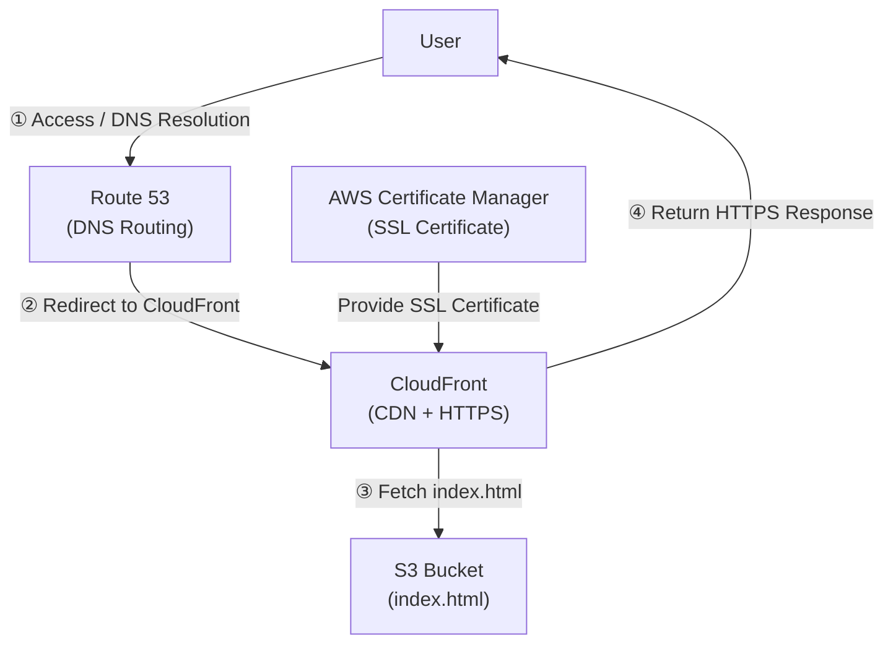

# Static Website Hosting with S3 + CloudFront + Route 53

## ✅ Site URL  
https://www.takahiro-hasegawa.net

## ✅ AWS Services Used  
- Amazon S3 (Static Website Hosting)  
- Amazon CloudFront (CDN + HTTPS)  
- Amazon Route 53 (DNS)  
- AWS Certificate Manager (SSL Certificate)

## ✅ Overview  
This project demonstrates how to host a static website using a custom domain (`www.takahiro-hasegawa.net`) with full HTTPS support by combining multiple AWS services.  
The `index.html` file hosted in S3 is delivered via CloudFront, DNS routing is handled by Route 53, and HTTPS is enabled through ACM.

## ✅ Architecture Diagram  

## ✅ Implementation Steps
- Purchased a custom domain from onamae.com
- Set up Route 53 as the nameserver and created a hosted zone
- Created an S3 bucket matching the domain name and enabled static website hosting
- Set up CloudFront with the S3 origin and configured HTTPS delivery
- Issued an SSL certificate in the N. Virginia region and applied it to CloudFront
- Added an A record (Alias) in Route 53 to route traffic from the domain to CloudFront
- Executed cache invalidation to reflect changes immediately

## ✅ Key Learnings
- Integration between AWS services (S3 / CloudFront / Route 53 / ACM)
- Understanding of DNS, SSL certificate issuance, CNAME validation, and HTTPS
- Behavior and importance of cache control and CDN
- Troubleshooting and resolving issues independently during deployment

## ✅ Notes
The HTML content itself is intentionally simple—this project focuses on designing and deploying the AWS infrastructure.
