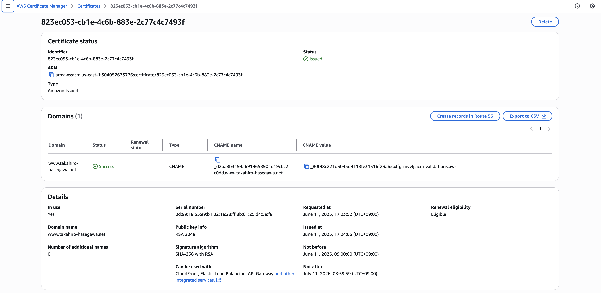

# Static Website Hosting with S3 + CloudFront + Route 53

## ✅ Deployed Site   
URL：https://www.takahiro-hasegawa.net

## ✅ AWS Services Used  
- Amazon S3 (Static Website Hosting)  
- Amazon CloudFront (CDN + HTTPS)  
- Amazon Route 53 (DNS)  
- AWS Certificate Manager (SSL Certificate)

## ✅ Overview  
This project demonstrates how to host a static website using a custom domain (`www.takahiro-hasegawa.net`) with full HTTPS support by combining multiple AWS services.  
The `index.html` file hosted in S3 is delivered via CloudFront, DNS routing is handled by Route 53, and HTTPS is enabled through ACM.

## ✅ Architecture Diagram  

## ✅ Service Configuration Details

### 1. Route 53 (A Record)
Configured DNS routing from `www.takahiro-hasegawa.net` to the CloudFront distribution.

### 2. CloudFront General Settings (HTTPS & Alternate Domain)
Set up a custom domain and applied an SSL certificate from AWS Certificate Manager.

### 3. CloudFront Origin Settings (S3 Integration)
Defined the origin of the distribution as an S3 bucket hosting the static content.

### 4. SSL Certificate (ACM)
Issued in the N. Virginia (`us-east-1`) region and validated via CNAME record.

### 5. S3 Object: index.html
Uploaded and stored `index.html` as the main content of the website.

### 6. S3 Static Website Hosting
Enabled static website hosting from the S3 bucket's properties.

### 7. Final Website Display
Verified HTTPS access to the website via CloudFront using the custom domain.

## ✅ Key Learnings
- Integration between AWS services (S3 / CloudFront / Route 53 / ACM)
- Understanding of DNS, SSL certificate issuance, CNAME validation, and HTTPS
- Behavior and importance of cache control and CDN
- Troubleshooting and resolving issues independently during deployment

## ✅ Notes
The HTML content itself is intentionally simple—this project focuses on designing and deploying the AWS infrastructure.
