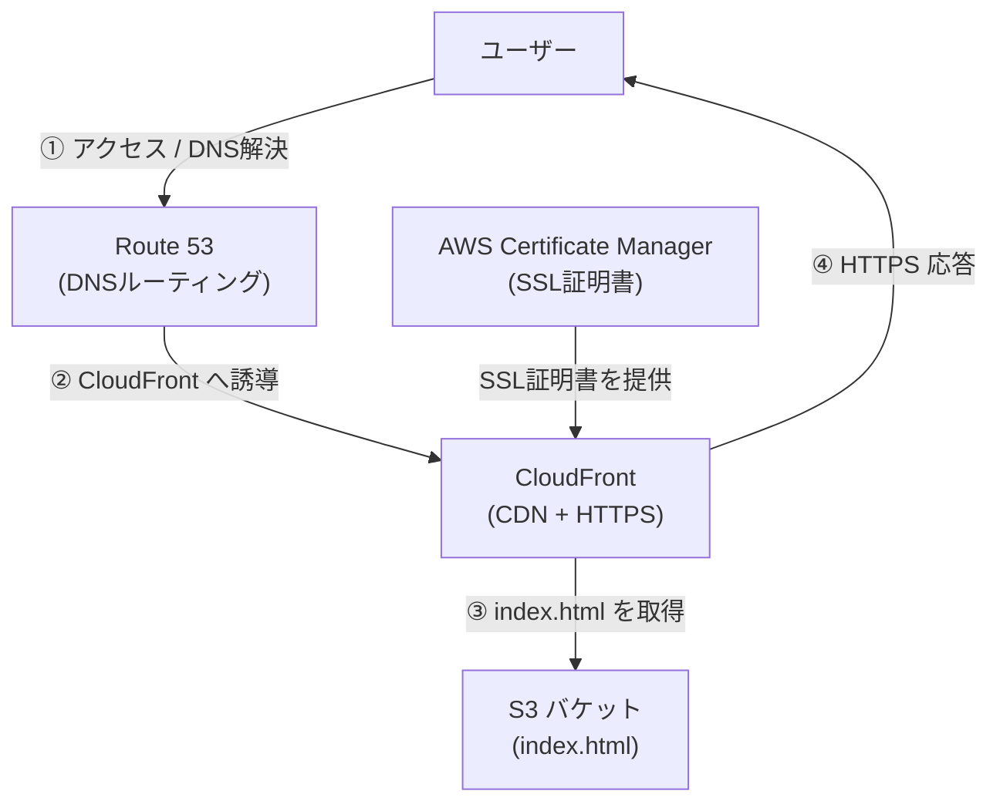

# S3 + CloudFront + Route 53 による静的Webサイト公開

## ✅ サイトURL
https://www.takahiro-hasegawa.net

## ✅ 使用AWSサービス
- Amazon S3（静的Webサイトホスティング）
- Amazon CloudFront（CDN + HTTPS）
- Amazon Route 53（DNS）
- AWS Certificate Manager（SSL証明書）

## ✅ 構成概要
独自ドメインである `www.takahiro-hasegawa.net` を利用し、AWSの各種サービスを組み合わせて静的WebサイトをHTTPS対応で公開した。S3にホスティングされた`index.html`をCloudFront経由で配信し、Route 53でDNSルーティング、ACMでHTTPS対応。

## ✅ 構成図

## ✅ 実施内容
- お名前.comで独自ドメインを取得
- ネームサーバーをRoute 53に設定し、ホストゾーンを作成
- S3バケットをドメイン名と一致させて作成、静的ホスティングを有効化
- CloudFrontでオリジンにS3を指定し、HTTPS配信を構成
- バージニア北部リージョンでSSL証明書を発行し、CloudFrontに適用
- Route 53にAレコード（Alias）を追加し、独自ドメインからCloudFrontへルーティング
- キャッシュ削除（Invalidation）を実施し、変更を即時反映

## ✅ 学んだこと
- AWSサービス間の連携（S3/CloudFront/Route 53/ACM）
- DNSやSSL証明書の仕組み、CNAME検証、HTTPS通信
- キャッシュコントロールやCDNの役割
- トラブル発生時の自力での原因調査と解決方法

## ✅ 備考
HTML自体は非常に簡素なものであり、今回はインフラ構成と公開の実現を主目的としている。
