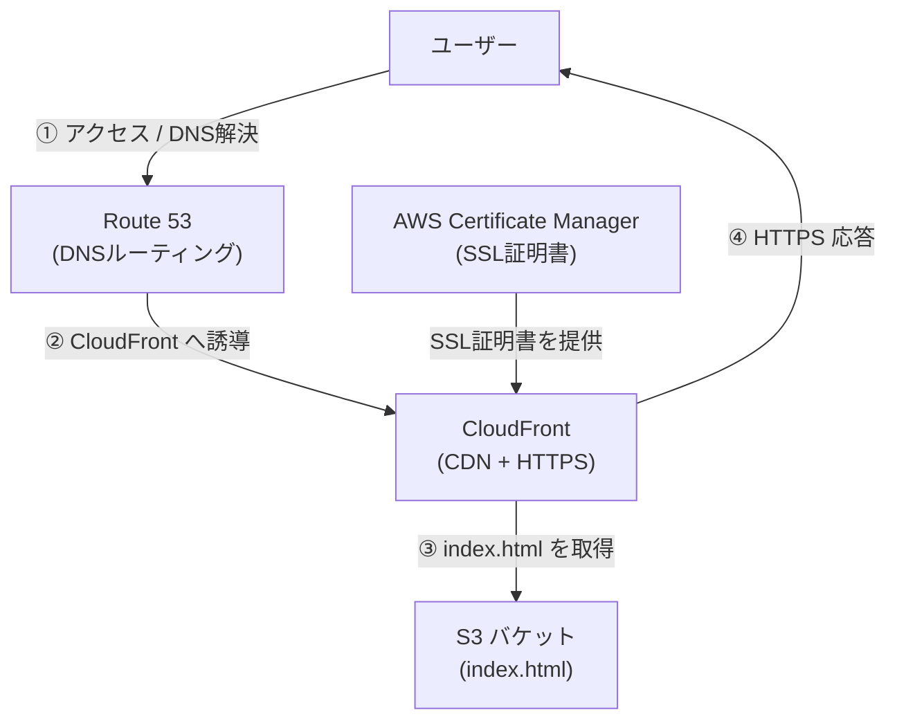

# S3 + CloudFront + Route 53 による静的Webサイト公開

## ✅ サイトURL
https://www.takahiro-hasegawa.net

## ✅ 使用AWSサービス
- Amazon S3（静的Webサイトホスティング）
- Amazon CloudFront（CDN + HTTPS）
- Amazon Route 53（DNS）
- AWS Certificate Manager（SSL証明書）

## ✅ 構成概要
独自ドメインである `www.takahiro-hasegawa.net` を利用し、AWSの各種サービスを組み合わせて静的WebサイトをHTTPS対応で公開した。S3にホスティングされた`index.html`をCloudFront経由で配信し、Route 53でDNSルーティング、ACMでHTTPS対応。

## ✅ 構成図

## ✅ 実装ステップと画面キャプチャ

### ① Route 53: 独自ドメインとホストゾーン作成  
`お名前.com`で取得したドメインに対し、Route 53でホストゾーンを作成し、NSレコードを取得。

→ `お名前.com` 側でネームサーバーを上記に変更。

### ② S3: 静的Webサイトホスティング設定

- バケット名は `www.takahiro-hasegawa.net`
- 静的ホスティングを有効化、`index.html`をアップロード

  

### ③ ACM: バージニア北部でSSL証明書を発行

- `takahiro-hasegawa.net`, `www.takahiro-hasegawa.net` を登録
- DNS検証を使用（Route 53が自動でCNAMEレコードを設定）

### ④ CloudFront: ディストリビューション作成と設定

- オリジンにS3（静的ホスティングURL）を指定
- カスタムドメインに独自ドメインを追加し、ACM証明書を選択
- デフォルトルートオブジェクトは `index.html`

### ⑤ Route 53: Aレコード（ALIAS）追加でCloudFrontと接続

### ⑥ 動作確認とdigコマンド

- `https://www.takahiro-hasegawa.net` にアクセスして表示確認
- `dig` でCloudFrontのCNAME解決も確認

  

## ✅ 学んだこと
- AWSサービス間の連携（S3/CloudFront/Route 53/ACM）
- DNSやSSL証明書の仕組み、CNAME検証、HTTPS通信
- キャッシュコントロールやCDNの役割
- トラブル発生時の自力での原因調査と解決方法

## ✅ 備考
HTML自体は非常に簡素なものであり、今回はインフラ構成と公開の実現を主目的としている。
