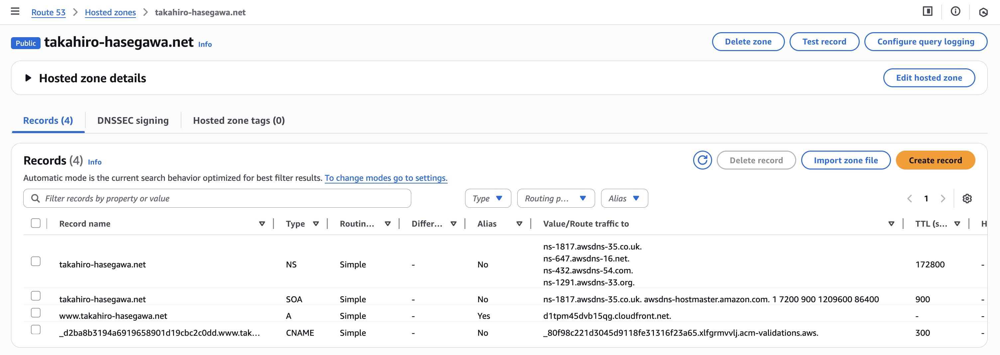
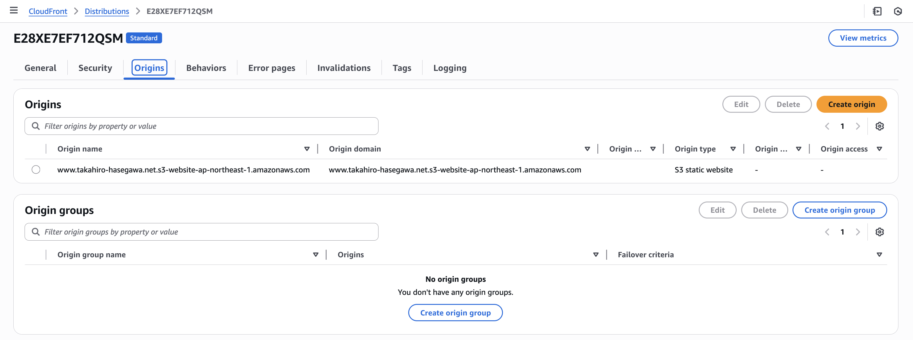
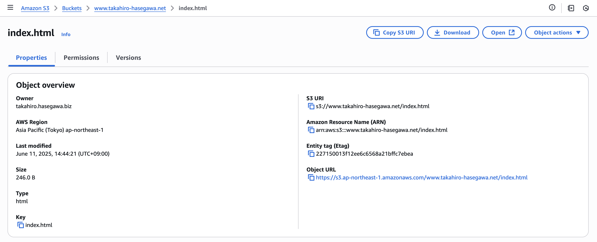
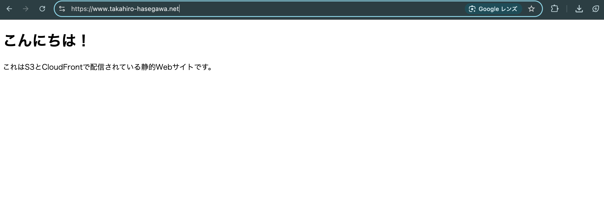

# S3 + CloudFront + Route 53 による静的Webサイト公開

## ✅ 成果物
サイトURL：https://www.takahiro-hasegawa.net

## ✅ 使用AWSサービス
- Amazon S3（静的Webサイトホスティング）
- Amazon CloudFront（CDN + HTTPS）
- Amazon Route 53（DNS）
- AWS Certificate Manager（SSL証明書）

## ✅ 構成概要
独自ドメインである `www.takahiro-hasegawa.net` を利用し、AWSの各種サービスを組み合わせて静的WebサイトをHTTPS対応で公開した。S3にホスティングされた`index.html`をCloudFront経由で配信し、Route 53でDNSルーティング、ACMでHTTPS対応。

## ✅ 構成図

## ✅ 各サービス設定詳細

### 1. Route 53 設定（Aレコード）
独自ドメイン `www.takahiro-hasegawa.net` を CloudFront にルーティングするための設定。

### 2. CloudFront 一般設定（HTTPS・代替ドメイン）
カスタムドメイン名と ACM による SSL 証明書を設定。

### 3. CloudFront オリジン（S3との接続）
オリジンに静的Webサイトをホスティングした S3 バケットを指定。

### 4. 証明書発行（ACM）
バージニア北部（us-east-1）リージョンでの SSL 証明書発行と CNAME 検証完了後の状態。

### 5. S3 に配置した index.html の情報
ホスティング対象となる `index.html` のファイル情報画面。

### 6. 静的ホスティング設定（S3プロパティ）
S3 バケットのプロパティで静的ウェブサイトホスティングを有効化した設定。

### 7. ブラウザでの表示確認（完成画面）
CloudFront経由で HTTPS による安全な配信が確認できる完成状態。

## ✅ 学んだこと
- AWSサービス間の連携（S3/CloudFront/Route 53/ACM）
- DNSやSSL証明書の仕組み、CNAME検証、HTTPS通信
- キャッシュコントロールやCDNの役割
- トラブル発生時の自力での原因調査と解決方法

## ✅ 備考
HTML自体は非常に簡素なものであり、今回はインフラ構成と公開の実現を主目的としている。
